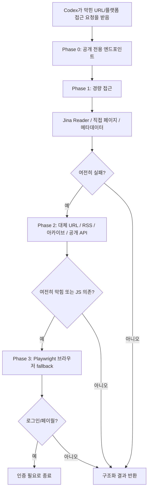

# Codex Insane Search

> 막히는 웹 접근을 위해 `insane-search`를 Codex 기준으로 다시 정리한 플러그인입니다.

[Read the English README](./README.md)

## 개요

이 저장소는 `insane-search` 아이디어를 Codex에 맞게 옮긴 버전입니다.

- 가벼운 공개 접근을 먼저 시도하고
- 플랫폼별 공개 엔드포인트를 우선 활용하고
- 그래도 안 되면 브라우저 fallback으로 넘기고
- 로그인/페이월은 우회하는 척하지 않고 명시적으로 보고합니다

동시에 두 가지를 제공합니다.

- [`plugins/insane-search`](./plugins/insane-search/) 에 들어있는 **Codex plugin**
- Windows 로컬 Codex에 바로 연결하는 **설치 스크립트**

## 구조



## 이 버전에서 고친 점

- `4-phase`와 `5-phase`가 섞이던 설명을 **4-phase로 통일**
- **Jina Reader rate limit** 설명 수정
- PowerShell/Windows 기준 설치 경로 제공
- bash-only 예시 대신 Codex + PowerShell 흐름 중심으로 재작성
- Codex의 `web`, Playwright, shell 사용 방식에 맞게 문서 정리

## 주요 경로

| 경로 | 역할 |
|---|---|
| [`plugins/insane-search/.codex-plugin/plugin.json`](./plugins/insane-search/.codex-plugin/plugin.json) | 플러그인 매니페스트 |
| [`plugins/insane-search/skills/insane-search/SKILL.md`](./plugins/insane-search/skills/insane-search/SKILL.md) | 메인 Codex skill |
| [`plugins/insane-search/skills/insane-search/references/`](./plugins/insane-search/skills/insane-search/references/) | 검색 전략 문서 |
| [`scripts/install-local.ps1`](./scripts/install-local.ps1) | 로컬 설치 |
| [`scripts/uninstall-local.ps1`](./scripts/uninstall-local.ps1) | 로컬 제거 |
| [`scripts/validate.ps1`](./scripts/validate.ps1) | 구조 검증 |

## 로컬 설치

```powershell
git clone https://github.com/sinmb79/codex-insane-search.git
cd codex-insane-search
powershell -ExecutionPolicy Bypass -File .\scripts\install-local.ps1
```

설치 스크립트는 다음을 수행합니다.

1. 현재 저장소의 플러그인을 `~/plugins/insane-search`에 junction으로 연결
2. `~/.agents/plugins/marketplace.json`에 엔트리 추가 또는 갱신
3. 이후 로컬 수정이 바로 Codex 설치본에 반영되도록 구성

## 사용 예시

- `Summarize this Medium article`
- `Pull the latest tweets from @openai`
- `Read this Naver blog post`
- `Get the top Hacker News stories with scores`
- `Extract metadata from this blocked product page`

## 한계

- 로그인/페이월은 우회하지 않습니다. 필요하면 그대로 `authentication required`로 보고해야 합니다.
- 브라우저 fallback은 비용이 큽니다. 이 스킬은 싼 방법을 먼저 쓰도록 설계되어 있습니다.
- 공개 엔드포인트는 시간이 지나면 바뀔 수 있습니다. 문서는 실전 중심 가이드입니다.

## 검증

```powershell
powershell -ExecutionPolicy Bypass -File .\scripts\validate.ps1
```

## 참조한 GitHub 작업

이 저장소는 Codex 기준으로 다시 작성한 구현이지만, 아래 공개 GitHub 자료를 명시적으로 참고했습니다.

- [`fivetaku/insane-search`](https://github.com/fivetaku/insane-search): 막히는 웹 접근이라는 제품 아이디어와 기본 워크플로 영감
- [`HackerNews/API`](https://github.com/HackerNews/API): 문서에 반영한 Hacker News 공개 엔드포인트 기준

외부 저장소 코드를 그대로 가져오지는 않았습니다. 실제 구현, 매니페스트 구성, PowerShell 설치 흐름, Codex용 skill 포장은 이 저장소에서 다시 만들었습니다.
