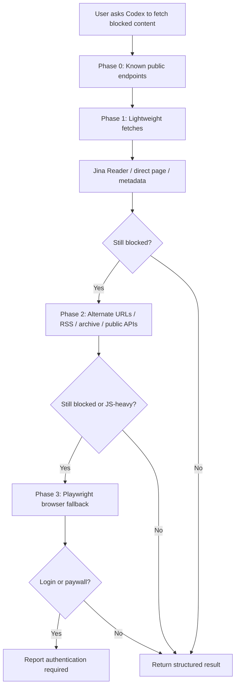

# Codex Insane Search

> A Codex-first adaptation of `insane-search` for stubborn web access, public endpoint discovery, and browser fallback.

[Read this in Korean](./README.ko.md)

## What It Is

Codex Insane Search packages a practical search-and-fetch workflow for Codex:

- try lightweight public access first
- use platform-specific public endpoints when they are better than scraping
- fall back to a real browser only when the cheap paths fail
- stay honest about login walls, paywalls, and blocked content

This repo ships both:

- a **Codex plugin** at [`plugins/insane-search`](./plugins/insane-search/)
- a **local install script** for immediate personal use on Windows

## Architecture



## Why This Version Exists

The original `insane-search` repo is a strong idea, but it is shaped around Claude-specific plugin semantics and shell assumptions.

This Codex version fixes the parts that matter for real use:

- consistent **4-phase** model instead of mixed 4/5-phase wording
- corrected **Jina Reader rate-limit guidance**
- Windows-friendly local install path for Codex
- PowerShell-first examples instead of bash-only assumptions
- Codex tool guidance for `web`, Playwright, and shell workflows

## Repo Layout

| Path | Purpose |
|---|---|
| [`plugins/insane-search/.codex-plugin/plugin.json`](./plugins/insane-search/.codex-plugin/plugin.json) | Plugin manifest |
| [`plugins/insane-search/skills/insane-search/SKILL.md`](./plugins/insane-search/skills/insane-search/SKILL.md) | Main Codex skill |
| [`plugins/insane-search/skills/insane-search/references/`](./plugins/insane-search/skills/insane-search/references/) | Search strategy reference docs |
| [`scripts/install-local.ps1`](./scripts/install-local.ps1) | Local install for your Codex environment |
| [`scripts/uninstall-local.ps1`](./scripts/uninstall-local.ps1) | Local uninstall |
| [`scripts/validate.ps1`](./scripts/validate.ps1) | Smoke-check for manifests and file layout |
| [`.agents/plugins/marketplace.json`](./.agents/plugins/marketplace.json) | Repo-local marketplace entry |

## Local Install

### Windows / PowerShell

```powershell
git clone https://github.com/sinmb79/codex-insane-search.git
cd codex-insane-search
powershell -ExecutionPolicy Bypass -File .\scripts\install-local.ps1
```

What the installer does:

1. Creates a junction from your local repo plugin to `~/plugins/insane-search`
2. Adds or updates the plugin entry in `~/.agents/plugins/marketplace.json`
3. Leaves your repo as the source of truth, so local edits stay live

## Usage

After installation, restart Codex and ask naturally:

- `Summarize this Medium article`
- `Pull the latest tweets from @openai`
- `Read this Naver blog post`
- `Get the top Hacker News stories with scores`
- `Extract metadata from this blocked product page`

## Important Limits

- This plugin does **not** defeat authentication. If a site requires login, Codex should say so.
- Browser fallback is expensive. The skill is designed to prefer cheap methods first.
- Public endpoint stability changes over time. The references are intentionally pragmatic, not theoretical.

## Validation

Run:

```powershell
powershell -ExecutionPolicy Bypass -File .\scripts\validate.ps1
```

## References

- Original inspiration: [fivetaku/insane-search](https://github.com/fivetaku/insane-search)
- Jina Reader docs: [jina.ai/reader](https://jina.ai/ko/reader/)
- Official Hacker News API: [github.com/HackerNews/API](https://github.com/HackerNews/API)

## Referenced GitHub Work

This repository is an original Codex-oriented rewrite, but it was informed by a small set of public GitHub references:

- [`fivetaku/insane-search`](https://github.com/fivetaku/insane-search): the main product and workflow inspiration for the blocked-web access idea
- [`HackerNews/API`](https://github.com/HackerNews/API): the official reference for Hacker News public endpoint behavior used in the docs

No external repository code is vendored here. The implementation, manifest shape, PowerShell install flow, and Codex skill packaging were rebuilt for the Codex plugin workflow.
